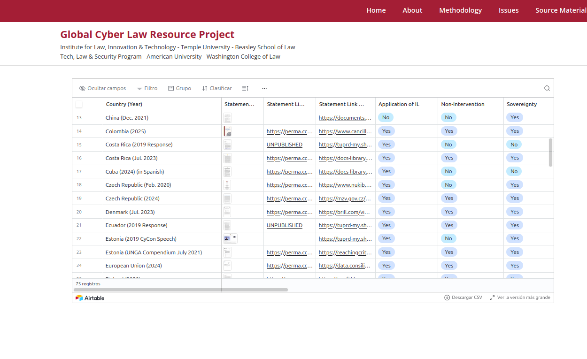
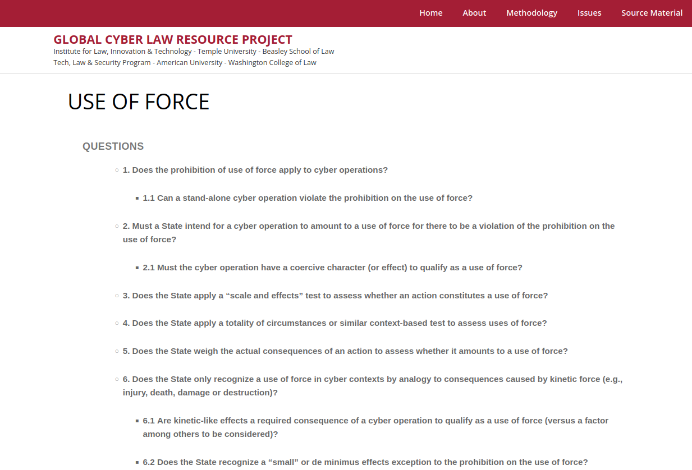
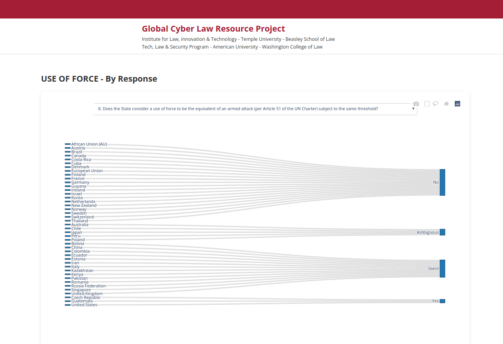
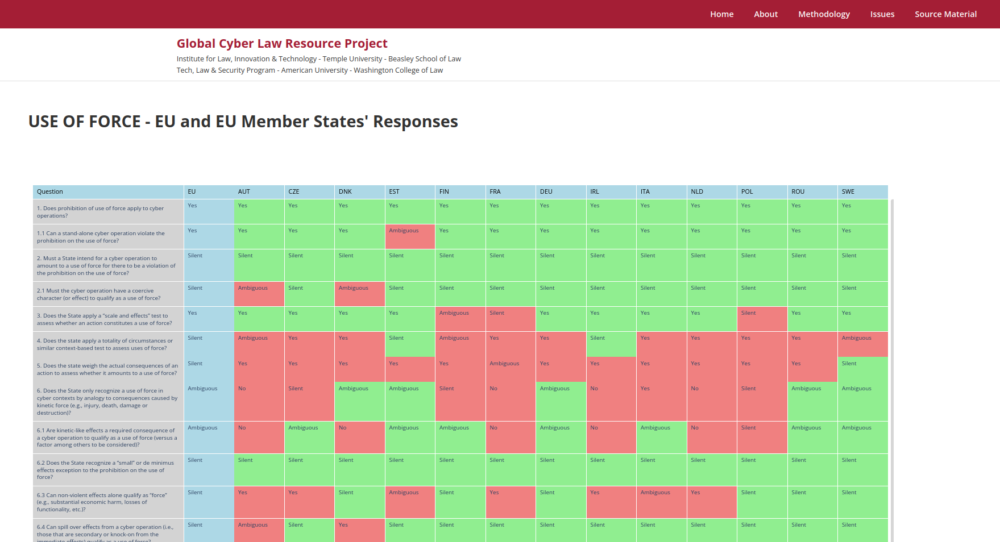
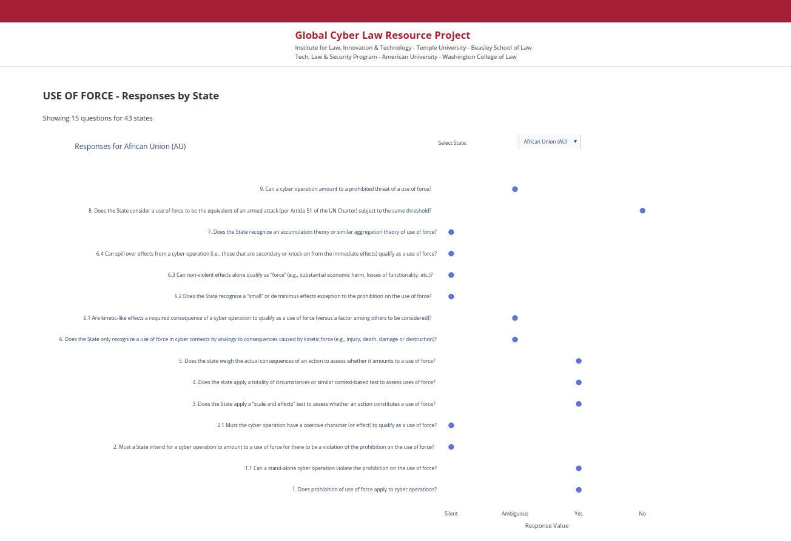
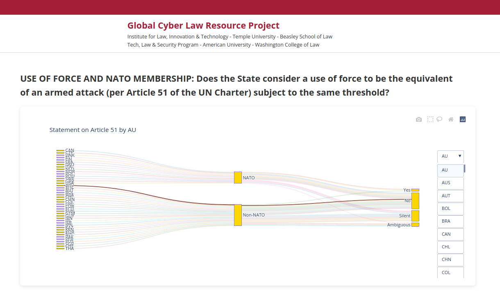
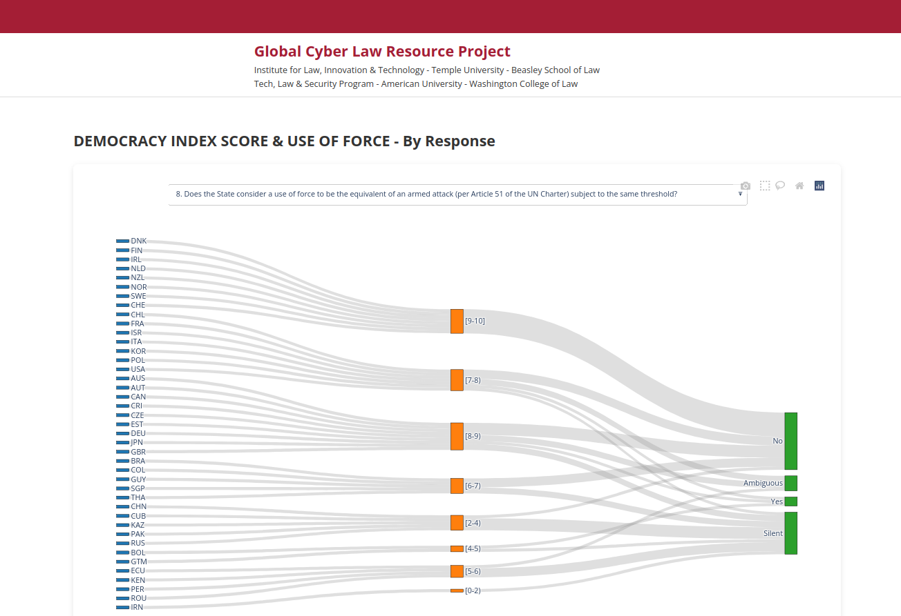

# National Statements Visualizations (Fall 2025)
This is a web app built with Django in Python, that makes use of Python's data visualizations libraries Pandas and Numpy. It uses Plotly for graph generation.
It includes the Airtable image. It also includes new visualizations of state responses to Use of Force policy. 
These visualizations includes: 

- A sankey diagram displaying states and their responses to each of the Use of Force questions.
- A sankey diagram displaying states and their responses to each of the Use of Force questions, layered with their democracy score range.
- A scatter plot of overall Use of Force questions.
- A scatter plot of Use of Force questions, filtered by state.
- A sankey diagram displaying states and their response to Question 8 of Use of Force, layered with NATO membership.
- A table that compares EU member states' responses to EU's responses, in the issue area Use of Force











## Getting Started

## Local Dev Environment

### Requirements

Technical requirements for this project. See below for step-by-step first-time setup.

| Tool           | Version  |
|----------------|----------|
| Django         | v4.0.3   |
| numpy          | v1.26.4  |
| pandas         | v2.2.3   |
| PostgreSQL     | 16.3     |
| docker-compose | 2.x      |
| plotly         | v5.6.0   |

### Environment Setup

Clone the repo:

```sh
git clone git@https://gitlab.com/ilit-tu/owls-nat-state-vis-v4
```

Alternately, if you don't already have an SSH key setup with Github:
```sh
git clone https://gitlab.com/ilit-tu/owls-nat-state-vis-v4
```

Once the repo is checked out, change to the directory with `cd <directory name>` until you're in the directory containing the Dockerfile and docker-compose.yml

### Running Locally With Docker


1. If you don't already have it, install [Docker Desktop](https://www.docker.com/products/docker-desktop/) (or an alternative like [OrbStack](https://orbstack.dev)).
2. Run `docker-compose up --build`
3. **Chill for a minute.** The first time you run this command it needs to download dependencies and build the app image before it can start the containers. It should be much faster the next time.


You should eventually see a message in the console like
```
 Starting development server at http://0.0.0.0:8000/
```

That means the servers are running and you should be able to access the test site in a browser at http://localhost:8000/

- If there is an error loading the data from the Use of Force or Democracy Scores tables, run 
`docker-compose exec web python manage.py load_use_of_force` and
`docker-compose exec web python manage.py load_democracy_scores`,
then shut down the app with `docker-compose down -v` and restart with `docker-compose up` (or `docker-compose up --build` if the former is unsuccessful.)


(When you're done and want to shut it down, press Ctrl+C in that terminal or run `docker compose down` from a different terminal.)

-You may need to run `docker-compose down -v` to remove docker volumes if when you are running the app a second or additional time, 
you get an error message that a name or resource is already in use.
